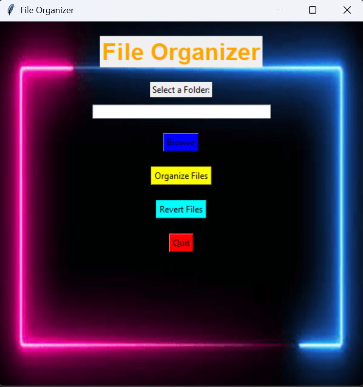

📂 File Organizer
A Python-based File Management System with an intuitive Tkinter GUI.  
Easily organize your files by type, browse folders, and revert changes with a single click.

✨ Features
- Browse Folder: Select any directory to organize.
- Organize Files: Automatically sort files into folders by their type (e.g., Images, Documents, Videos).
- Revert Changes: Restore files to their original location.
- Colorful & Modern UI: Eye-catching design for a better user experience.
- Easy Navigation: Simple interface for beginners and pros.

🖥️ Screenshot

